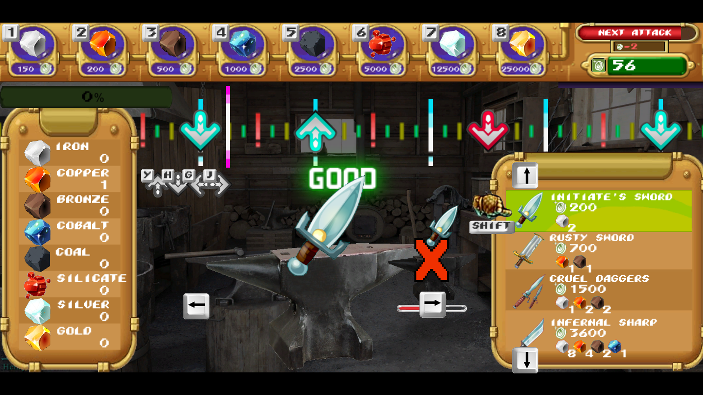

Repository link : https://github.com/StardustMotion/playground/tree/master/jeuxSerieux/armyBlacksmith

# Army BlackSmith

#### By Stardust Motion (Kévin Alessandro), Raynaud Jean-Baptiste, Iradukunda Valentin, Lazlo Barragan, Romain Saclier #

A projet for a course led by Abdelkader Gouaich at Université de Montpellier, January 2021

The game design, technical design and theme inspiration documents are also present for legacy purposes albeit a little outdated.

### Changelog

- v1.1 (29/12/2020)

	> Added an easy mode, with less mathematically increasing attacks and beat sequences with only half inputs
	
	> Repositionned lateral anvils and the key input 
	
	> Fixed ore menu's hotkey so it works with both Numpad and NumKeys

### Setup guide

Download the armyBlacksmith_v1_1.zip archive and extract its content somewhere. Run the armyBlacksmith.exe file.

### Lore

Circa middle ages, you're a blacksmith in a small village and your role is to assist the village's protection by calling upon the deities's blessing.
You will forge weapons which you can then give as offering to the gods, and they'll protect your village.
But you'll need resources to do that.

You will frequently be robbed by invaders, so beware.

### How to play

Army Blacksmith is a music and action/management game. It can be (and is recommended) to play on keyboard. Mouse-only can be done too,
aside from the music sequences.
### TO QUIT THE GAME, PRESS ALT+F4 !!! 
##### kthx

The general pattern is as follow :
1) Buy ore, the essential resources for making weapons
2) Select a weapon to craft
3) Forge it ; this is represented as a rythm sequence
4) The hot weapon is cooling down. When it's ready, you can choose to sell it or give as offering

Each time you buy an unit of ore, its price increases due to inflation. It lowers back over time.

Selling a weapon grants you money depending on how good you were on the forging sequence. Selling value ranges from 50% to 200% of the weapon's base price. The base price of a weapon is equal to the cost of its ingredient without inflation.
So if a weapon's recipe is 1xCopper and 2xBronze ; copper's base price being 200 and bronze 500 then the weapon's base price is 1200.
You thus want to earn money with a margin by selling the weapon!

Offering a weapon to the gods does two things.
1) It gets you closer to the objective of the game : it fills the offering bars, which you need to get to 100% to win.
2) It softens the aggresiveness of the attacks.

The attacks is a plundering event occuring every 30 seconds, where your money gets reduced by a fixed amount. This amount increases over time.
These attacks can make you have negative money. There is no game over screen, but you can assume you're done if you basically
can't buy or forge anymore anything.
Offering weapons reduces the attacks's power. The bigger the offering, the more important the protection.

The game has an easy and normal mode. Playing in easy is strongly advised on your first tries, ESPECIALLY if you have no experience with rythm game.

### Credits

Game engine : Unity 

> Sprite work :

	> All sprites are taken from Dofus 1.29, Insaniquarium Deluxe and Atomica Deluxe
	> Game background by Henry Chervenka https://www.zbrushcentral.com/t/blacksmith-workshop/209686#post1236263
	
> Audio :

	> Background ambiance music https://www.youtube.com/watch?v=E77jmtut1Zc&
	> Sound effects from Insaniquarium Deluxe and Mega Man Zero ZX
	> Victory theme from Final Fantasy
